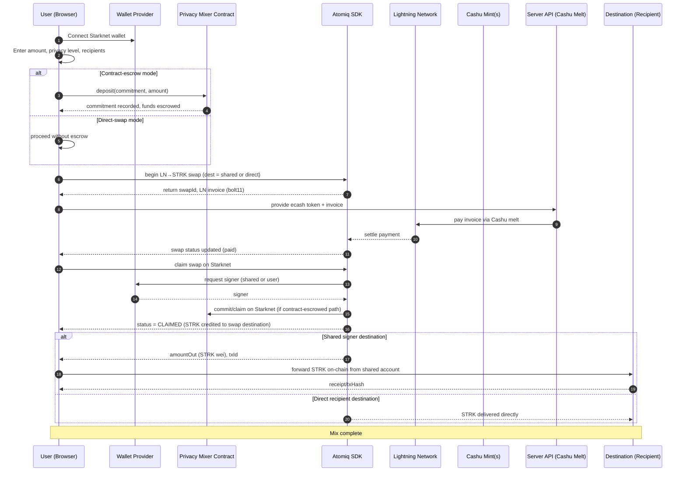

# SLPM Mixer Architecture

This document explains the Starknet Lightning Privacy Mixer (SLPM) end-to-end architecture and execution flow: user → privacy contract → Atomiq (STRK ↔ Lightning) → Cashu e-cash → Atomiq → recipient. It details the roles of each subsystem, data exchanged, security and privacy properties, and operational edge cases.

## Components

- Frontend (Next.js): Orchestrates the flow, collects user input (amount, destinations, privacy level), tracks progress, and displays status.
- Wallet Provider (Starknet): Manages user wallet connection and signing for on-chain operations.
- Privacy Mixer Contract (Starknet): Receives deposits, records commitments/nullifiers, and enforces withdrawal rules. Holds funds during the mix lifecycle in designs that route through the contract.
- Atomiq SDK: Cross-chain swap engine for STRK ↔ Bitcoin Lightning. Produces LN invoices and claims swaps on Starknet using a signer.
- Lightning Network: Settlement layer for BTC payments used as a privacy hop.
- Cashu Mint(s): E-cash issuers that convert paid LN invoices into bearer tokens and later melt tokens back to LN payments.
- Server API (optional): Performs server-side Cashu receive-and-melt with retries to remove client instability and wallet prompts.

## High-level Flow

1. User inputs amount and recipient(s), connects wallet.
2. STRK is moved into the mixing pipeline. Depending on mode, funds are either escrowed in the Privacy Mixer Contract or swapped directly.
3. STRK → LN via Atomiq: Atomiq creates a LN invoice that will be paid using ecash melt; later, the swap is claimed on Starknet by a signer that controls the destination address.
4. LN → Cashu: The LN invoice is paid, minting Cashu tokens. Tokens are shuffled, optionally across multiple mints, split, and time-delayed.
5. Cashu → LN: Cashu tokens are melted into a new LN payment that targets a second Atomiq invoice for STRK.
6. LN → STRK via Atomiq: Atomiq claims the swap using the appropriate Starknet signer and releases STRK to a destination account. If a shared signer is used, STRK is then forwarded on-chain to the final recipient address(es).

## Detailed Sequence



## Component Responsibilities and Contracts

### Frontend Orchestrator
- Calculates safe LN invoice sizes from available Cashu token balance.
- Initiates Atomiq swaps and tracks status.
- Invokes server-side Cashu melt API to pay invoices and handle retryable errors.
- Requests claims from Atomiq when LN invoices are paid.
- If a shared destination is used, forwards STRK to final recipient(s) using a Starknet account and ERC-20 transfer.

Inputs
- Amount in STRK and recipient addresses.
- Privacy level options: time delays, split outputs, multi-mint routing.
- Encoded Cashu token for melt payment.

Outputs
- Atomiq swap IDs and invoices.
- Status events: deposit, melting, claim, forward, complete.
- Final STRK transfer hash when forwarding.

### Wallet Provider
- Maintains a persistent wallet connection.
- Provides a Starknet signer for contract interactions and Atomiq claims.
- Can expose a shared signer account (environment-configured) when the claim destination must be controlled by a centralized signer.

### Privacy Mixer Contract
- Stores deposit commitments and prevents double-spending via nullifiers.
- Optional escrow of STRK funds during the mix.
- Supports withdrawal to recipients post-mixing if the architecture demands contract custody.

State
- Commitments, nullifiers, accounting totals.

APIs
- deposit(commitment, amount)
- withdraw(nullifier, recipient, amount, proof)
- read-only stats.

### Atomiq SDK
- Creates LN invoices for STRK destination swaps.
- Claims swaps on Starknet with a signer that controls the destination.
- Provides status and output amounts (must be parsed into Wei).

Constraints
- The claim signer must control the swap destination address. When using a shared signer, route destination to that account and forward to the end recipient afterward.

### Lightning Network
- Settles LN invoices generated by Atomiq or Cashu mints.
- Provides payment preimages/hashes as needed by swap protocols.

### Cashu Mint(s)
- Issue ecash tokens when LN invoices are paid.
- Melt ecash tokens back to LN payments.
- Provide proof-state validation and change tokens on partial melt.

### Server API (Cashu Melt)
- Accepts the encoded token and a target LN invoice.
- Executes receive-once semantics and melt with retry loops.
- Validates proof states, melt quotes, and handles change token generation.

## Topology Diagram

```mermaid
flowchart LR
    subgraph Browser
        UI[Frontend Orchestrator]
        WP[Wallet Provider]
    end

    subgraph Starknet
        PMC[Privacy Mixer Contract]
        SSA[Shared Signer Account]
        STRK[STRK ERC-20]
    end

    subgraph Cross-chain
        ATQ[Atomiq SDK]
        LN[Lightning Network]
        CASHU[Cashu Mint(s)]
    end

    UI -->|deposit/withdraw| PMC
    UI -->|start swap, claim| ATQ
    ATQ -->|claim (Starknet)| SSA
    SSA -->|transfer STRK| STRK
    ATQ -->|generate LN invoice| LN
    UI -->|encoded token + invoice| CASHU
    CASHU -->|melt payment| LN
    LN -->|settle| ATQ
    STRK -->|recipient| RCP[Final Recipient]
```

## Decentralized Mixing Properties

- Cross-domain break: STRK activity on Starknet is bridged through Lightning settlement, severing on-chain link analysis between deposit and withdrawal.
- Bearer privacy: Cashu tokens are bearer instruments with no ledger of transfers; when used between two LN swaps, they act as a privacy buffer.
- Amount obfuscation: Splitting outputs, routing via multiple mints, and using Atomiq price slippage introduce noise to exact amount correlation.
- Temporal privacy: Randomized time delays in ecash handling and forward transfers prevent timing analysis.
- Custodial flexibility: The system allows a decentralized user path (recipient-controlled signer for Atomiq claim) or a centralized hop (shared signer) to meet SDK constraints while still forwarding funds on-chain.

## Failure Modes and Recovery

- Invalid signer for claim: If the signer does not control the Atomiq destination, route swaps to a shared signer address and forward to recipient after claim. Validate signer health by fetching account nonce.
- Cashu melt pending proofs: Treat as transient; retry melt with backoff. Verify melt quotes and proof states; handle shortfalls by reducing invoice size using a safe-amount calculation.
- Timeout waiting for LN payment: Poll swap status up to a maximum time and surface a retry or refund path. Atomiq can mark swaps refundable or expired.
- Amount parsing errors: Atomiq may return decimal strings; convert to Wei using a robust decimal-to-Wei parser before on-chain transfers.
- Insufficient STRK for forwarding: Ensure the shared signer has enough ETH/STRK for fees. Surface errors and allow manual re-forwarding once funded.
- Contract withdrawal proofs invalid: When using escrow mode, ensure nullifier uniqueness and proof verification; provide clear error messages and logs.

## Configuration and Security Notes

- Environment variables must provide the Starknet RPC and, if using shared claims, the private key and address of the shared signer account.
- The shared signer must be a deployed Starknet account with funds for transaction fees.
- Server-side Cashu melt should be restricted and authenticated if exposed beyond the app.
- Use multiple trusted Cashu mints where available; avoid single-mint centralization for stronger anonymity sets.
- Log sensitive data carefully; avoid storing ecash tokens beyond their operational window.

## Summary

SLPM composes Starknet smart contracts, Atomiq cross-chain swaps, the Lightning Network, and Cashu ecash to provide strong practical privacy. By bridging on-chain STRK to off-chain LN and back, with bearer-token mixing in the middle, the system breaks direct on-chain linkability. The architecture supports both decentralized recipient-controlled claims and a pragmatic shared-signer mode with on-chain forwarding, ensuring reliable operation even under SDK constraints while preserving privacy characteristics.
